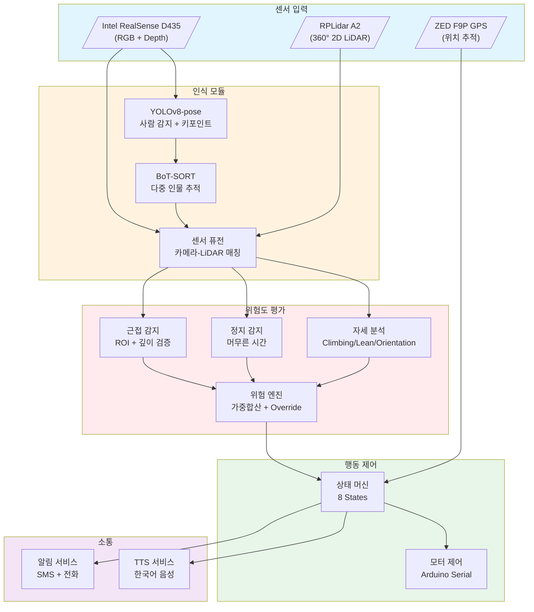
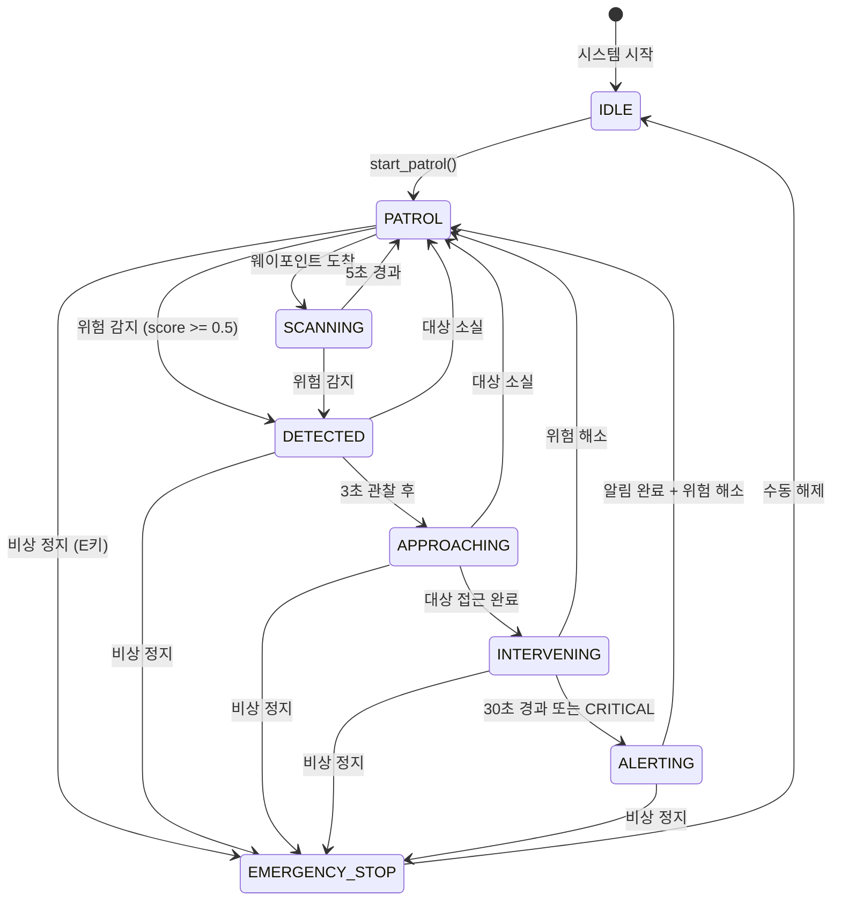

<p align="center">
  
  
  
  
  
  
</p>

<h1 align="center">Bridge Guardian</h1>
<h3 align="center">다리 위의 친구 - AI 자살 예방 자율 순찰 로봇</h3>

<p align="center">
  <b>YOLOv8-pose</b> + <b>2D LiDAR</b> + <b>Intel RealSense D435</b> 센서 퓨전으로<br/>
  다리 난간의 위험 행동을 감지하고, 자율 접근 -> 음성 개입 -> 긴급 전화까지 수행하는 로봇 시스템
</p>

---

## 목차

1. [프로젝트 개요](#프로젝트-개요)
2. [시스템 아키텍처](#시스템-아키텍처)
3. [동작 원리](#동작-원리)
4. [설치 가이드](#설치-가이드)
5. [실행 방법](#실행-방법)
6. [하드웨어 설정](#하드웨어-설정)
7. [최초 실행 체크리스트](#최초-실행-체크리스트)
8. [설정 파일](#설정-파일)
9. [트러블슈팅](#트러블슈팅)
10. [업그레이드 로드맵](#업그레이드-로드맵)
11. [FAQ](#faq)

---

## 프로젝트 개요

### 왜 만들었나?

매년 한국에서 자살로 사망하는 인원 중 **투신**은 주요 수단 중 하나입니다.  
다리에서의 자살 시도는 **사전 징후가 포착되면 충분히 개입 가능**합니다.

**Bridge Guardian**은 어린이 전동차를 개조한 자율 순찰 로봇으로,  
다리 위를 순찰하며 **감지 -> 접근 -> 음성 개입 -> 긴급 알림** 전체 파이프라인을 자동으로 수행합니다.

### 핵심 기능

| 기능 | 설명 | 담당 모듈 |
|------|------|-----------|
| **사람 감지** | YOLOv8-pose로 17개 키포인트 추출 + BoT-SORT 추적 | `perception/` |
| **거리 측정** | RealSense 깊이 카메라 + RPLidar 2D LiDAR 퓨전 | `perception/sensor_fusion` |
| **위험 자세 분석** | Climbing(기어오름), Lean(기울임), Orientation(방향) | `risk_assessment/pose_analyzer` |
| **위험도 평가** | 가중합산 + 시간대 보정 + Override 규칙 | `risk_assessment/risk_engine` |
| **자율 순찰** | GPS 웨이포인트 기반 경로 이동 | `navigation/` |
| **상태 머신** | 8단계 행동 제어 (순찰->감지->접근->개입->알림) | `behavior/state_machine` |
| **음성 개입** | 한국어 TTS로 위기 상황 대화 | `communication/tts_service` |
| **긴급 알림** | Twilio SMS + 자동 전화 발신 | `communication/alert_service` |

---

## 시스템 아키텍처

### 전체 시스템 흐름도



### 상태 머신 다이어그램



### 디렉토리 구조

```
Suicide_Prevention_Project/
├── config/
│   └── settings.yaml              # 전체 설정 파일 (7개 모듈 통합)
│
├── perception/                    # [인식 모듈]
│   ├── realsense_handler.py       # RealSense D435 카메라 드라이버
│   ├── person_detector.py         # YOLOv8n-pose + BoT-SORT 추적
│   ├── person_tracker.py          # 다중 인물 시계열 상태 관리
│   ├── lidar_handler.py           # RPLidar A2 드라이버 + 클러스터 감지
│   └── sensor_fusion.py           # 카메라-LiDAR-깊이 센서 퓨전
│
├── risk_assessment/               # [위험도 평가 모듈]
│   ├── pose_analyzer.py           # Climbing / Lean / Orientation 감지
│   ├── stationary_detector.py     # 정지 시간 기반 위험도
│   ├── proximity_detector.py      # ROI + Depth + LiDAR 근접 감지
│   └── risk_engine.py             # 가중합산 + 시간대 보정 + Override
│
├── navigation/                    # [내비게이션 모듈]
│   ├── gps_handler.py             # GPS NMEA 파싱 (pynmea2)
│   ├── motor_controller.py        # Arduino 시리얼 모터 제어
│   └── path_planner.py            # 순찰 웨이포인트 + 접근 경로
│
├── behavior/                      # [행동 제어 모듈]
│   └── state_machine.py           # 로봇 행동 상태 머신 (8 states)
│
├── communication/                 # [소통 모듈]
│   ├── alert_service.py           # 콘솔/로그/Twilio SMS+전화
│   └── tts_service.py             # 한국어 TTS 음성 안내
│
├── utils/                         # [유틸리티]
│   └── logger.py                  # 컬러 로깅
│
├── main.py                        # 메인 파이프라인 (진입점)
└── requirements.txt               # 의존성 목록
```

---

## 동작 원리

### 1단계: 인식 (Perception)

```
카메라 프레임 ──> YOLOv8-pose ──> 사람 검출 + 17개 키포인트
                                          │
                                          ▼
                                    BoT-SORT 추적
                                    (ID 부여 + 궤적)
                                          │
                          ┌───────────────┴───────────────┐
                          ▼                               ▼
                   RealSense 깊이                  RPLidar 거리
                   (bbox 중심 깊이)              (각도 매칭)
                          │                               │
                          └───────────┬───────────────────┘
                                      ▼
                               센서 퓨전 거리
                         (가중 평균: LiDAR 60% + Depth 40%)
```

### 2단계: 위험도 평가 (Risk Assessment)

**점수 계산 공식:**
```
최종 점수 = (정지×0.30 + 근접×0.35 + 자세×0.35) × 시간대_보정
```

**위험 등급:**

| 등급 | 점수 범위 | 색상 | 로봇 행동 |
|------|----------|------|----------|
| SAFE | 0.0 ~ 0.3 | 초록 | 계속 순찰 |
| OBSERVE | 0.3 ~ 0.5 | 초록 | 모니터링 |
| WARNING | 0.5 ~ 0.7 | 노랑 | TTS 인사 + SMS |
| DANGER | 0.7 ~ 0.85 | 빨강 | TTS 지원 안내 + SMS |
| CRITICAL | 0.85 ~ 1.0 | 마젠타 | TTS 긴급 + SMS + **전화** |

**Override 규칙:**
- Climbing(기어오름) 감지 -> 즉시 CRITICAL (점수 0.9 강제)
- 60초 정지 + 바깥 향함 + ROI 내 -> 최소 DANGER (점수 0.75)

### 3단계: 상태 머신 (Behavior)

| 상태 | 진입 조건 | 행동 | 다음 상태 |
|------|----------|------|----------|
| **IDLE** | 시스템 시작 | 정지 | PATROL |
| **PATROL** | start_patrol() | 웨이포인트로 이동 | SCANNING / DETECTED |
| **SCANNING** | 웨이포인트 도착 | 5초간 주변 스캔 | PATROL |
| **DETECTED** | 위험 점수 >= 0.5 | 3초간 정지 관찰 | APPROACHING |
| **APPROACHING** | 관찰 완료 | 대상에게 접근 | INTERVENING |
| **INTERVENING** | 접근 완료 | TTS 음성 개입 | ALERTING |
| **ALERTING** | 30초 경과 / CRITICAL | SMS + 전화 발신 | PATROL |
| **EMERGENCY_STOP** | E키 입력 | 완전 정지 | IDLE |

### 4단계: 소통 (Communication)

**TTS 메시지 순서:**
1. "안녕하세요, 괜찮으신가요?"
2. "많이 힘드셨나요? 잠시 이야기를 나눠볼까요?"
3. "자살예방상담전화 1393으로 연결해 드릴까요?"
4. "긴급 상황입니다. 119에 연락하고 있습니다."

**SMS/전화:**
- GPS 좌표 포함 SMS 자동 발송
- CRITICAL 시 자동 전화 발신

---

## 설치 가이드

### 요구사항

| 항목 | 최소 사양 | 권장 사양 |
|------|----------|----------|
| **OS** | Windows 10 / Ubuntu 20.04 | Windows 11 / Ubuntu 22.04 |
| **Python** | 3.10 | 3.10 ~ 3.11 |
| **GPU** | GTX 1650 (4GB) | RTX 3060 (12GB) |
| **RAM** | 8GB | 16GB |
| **저장공간** | 5GB | 10GB |

### Windows 설치

```powershell
# 1. 저장소 클론
git clone https://github.com/woongje-cho/Suicide_Prevention_Project.git
cd Suicide_Prevention_Project

# 2. 가상환경 생성 (권장)
python -m venv venv
.\venv\Scripts\activate

# 3. PyTorch 설치 (CUDA 11.8 기준)
pip install torch torchvision --index-url https://download.pytorch.org/whl/cu118

# 4. 나머지 의존성 설치
pip install -r requirements.txt

# 5. YOLOv8 모델 다운로드 (자동)
# 첫 실행 시 yolov8n-pose.pt 자동 다운로드됨
```

### Linux (Ubuntu) 설치

```bash
# 1. 시스템 의존성
sudo apt update
sudo apt install -y python3.10 python3.10-venv python3-pip
sudo apt install -y libgl1-mesa-glx libasound2-dev espeak mpg123

# 2. 저장소 클론
git clone https://github.com/woongje-cho/Suicide_Prevention_Project.git
cd Suicide_Prevention_Project

# 3. 가상환경 생성
python3.10 -m venv venv
source venv/bin/activate

# 4. PyTorch + 의존성 설치
pip install torch torchvision --index-url https://download.pytorch.org/whl/cu118
pip install -r requirements.txt
```

### Intel RealSense SDK 설치 (선택)

```bash
# Windows: Intel 공식 사이트에서 다운로드
# https://www.intelrealsense.com/sdk-2/

# Linux:
sudo apt-key adv --keyserver keyserver.ubuntu.com --recv-key F6E65AC044F831AC80A06380C8B3A55A6F3EFCDE
sudo add-apt-repository "deb https://librealsense.intel.com/Debian/apt-repo $(lsb_release -cs) main"
sudo apt update
sudo apt install librealsense2-dkms librealsense2-utils
pip install pyrealsense2
```

---

## 실행 방법

### 기본 실행 (웹캠 테스트)

```bash
# 웹캠으로 테스트 (하드웨어 없이)
python main.py --source 0 --no-lidar --no-gps --no-motor
```

### 비디오 파일 테스트

```bash
# 녹화된 영상으로 테스트
python main.py --source test_video.mp4 --no-lidar --no-gps --no-motor
```

### 전체 시스템 실행 (하드웨어 연결 시)

```bash
# 모든 센서 연결된 상태
python main.py

# 결과 영상 저장
python main.py --save-video output.mp4

# 화면 없이 실행 (헤드리스)
python main.py --no-display --save-video output.mp4
```

### CLI 옵션

| 옵션 | 설명 | 기본값 |
|------|------|--------|
| `--config` | 설정 파일 경로 | `config/settings.yaml` |
| `--source` | 카메라 소스 (0, 1, 파일경로) | 설정 파일 값 |
| `--no-display` | 시각화 창 끄기 | `False` |
| `--save-video` | 결과 영상 저장 경로 | 없음 |
| `--no-lidar` | LiDAR 비활성화 | `False` |
| `--no-gps` | GPS 비활성화 | `False` |
| `--no-motor` | 모터 비활성화 | `False` |
| `--no-tts` | TTS 음성 끄기 | `False` |

### 키보드 단축키

| 키 | 기능 |
|----|------|
| `Q` / `ESC` | 프로그램 종료 |
| `E` | 비상 정지 |
| `P` | 순찰 시작 |

---

## 하드웨어 설정

### 필요 부품

| 부품 | 모델 | 용도 | 예상 가격 |
|------|------|------|----------|
| **카메라** | Intel RealSense D435 | RGB + 깊이 | ~40만원 |
| **LiDAR** | RPLidar A2 | 360° 거리 측정 | ~25만원 |
| **GPS** | ZED F9P | 정밀 위치 | ~30만원 |
| **컴퓨터** | Windows 노트북 (GPU) | 메인 연산 | 기존 보유 |
| **모터 제어** | Arduino Uno | 시리얼 통신 | ~3만원 |
| **차량 플랫폼** | 어린이 전동차 (개조) | 이동 | ~10만원 |
| **스피커** | USB/3.5mm 스피커 | TTS 출력 | ~2만원 |

### 배선도

```
[노트북]
   │
   ├── USB 3.0 ──> [RealSense D435]
   │
   ├── USB ──> [RPLidar A2] ──> COM3 (Windows) / /dev/ttyUSB0 (Linux)
   │
   ├── USB ──> [ZED F9P GPS] ──> COM4 / /dev/ttyACM1
   │
   ├── USB ──> [Arduino Uno] ──> COM5 / /dev/ttyACM0
   │                 │
   │                 └── 모터 드라이버 ──> DC 모터 (좌/우)
   │
   └── Audio Out ──> [스피커]
```

### 모터 프로토콜 (Arduino)

```
명령 형식: s{steering}l{left_speed}r{right_speed}\n

steering : -7 (최대 좌회전) ~ 0 (직진) ~ +7 (최대 우회전)
speed    : 0 ~ 255 (PWM)

예시:
  s0l100r100\n   → 직진 속도 100
  s3l80r80\n     → 우회전 속도 80
  s-3l80r80\n    → 좌회전 속도 80
  s0l0r0\n       → 정지
```

---

## 최초 실행 체크리스트

하드웨어를 처음 연결하고 실행할 때 아래 순서를 따르세요.

### Step 1: 소프트웨어 테스트 (하드웨어 없이)

```bash
# 웹캠으로 기본 동작 확인
python main.py --source 0 --no-lidar --no-gps --no-motor --no-tts

# 확인 사항:
# [ ] 웹캠 영상이 뜨는가?
# [ ] 사람이 감지되는가? (바운딩 박스)
# [ ] 스켈레톤이 그려지는가?
# [ ] FPS가 10 이상인가?
```

### Step 2: 센서 개별 테스트

```bash
# 2-1. RealSense 테스트
python -c "import pyrealsense2 as rs; print('RealSense OK')"
# Intel RealSense Viewer로 영상 확인

# 2-2. LiDAR 테스트 (Windows 기준)
# 장치관리자에서 COM 포트 확인 후:
python -c "
from rplidar import RPLidar
lidar = RPLidar('COM3')
info = lidar.get_info()
print(f'LiDAR OK: {info}')
lidar.disconnect()
"

# 2-3. GPS 테스트
python -c "
import serial
ser = serial.Serial('COM4', 9600, timeout=1)
for _ in range(10):
    line = ser.readline().decode('ascii', errors='ignore')
    if line.startswith('\$GP'):
        print(f'GPS OK: {line.strip()}')
        break
ser.close()
"

# 2-4. Arduino 모터 테스트
python -c "
import serial
import time
ser = serial.Serial('COM5', 9600, timeout=1)
time.sleep(2)  # Arduino 부팅 대기
ser.write(b's0l50r50\n')  # 저속 전진
time.sleep(1)
ser.write(b's0l0r0\n')    # 정지
print('Motor OK')
ser.close()
"
```

### Step 3: 통합 테스트

```bash
# 3-1. 카메라 + LiDAR
python main.py --source 0 --no-gps --no-motor --no-tts
# 확인: 우측 하단에 LiDAR 미니맵이 보이는가?

# 3-2. 카메라 + LiDAR + GPS
python main.py --source 0 --no-motor --no-tts
# 확인: 좌측 하단에 GPS 좌표가 표시되는가?

# 3-3. 전체 시스템 (모터 제외)
python main.py --source 0 --no-motor
# 확인: TTS 음성이 나오는가?
```

### Step 4: 실제 환경 테스트

```bash
# 전체 시스템 실행
python main.py

# 확인 사항:
# [ ] P키로 순찰 시작 → 모터 동작?
# [ ] 사람 감지 → 위험도 표시?
# [ ] WARNING 이상 → TTS 재생?
# [ ] E키로 비상 정지 → 모터 즉시 정지?
```

### Step 5: 필드 테스트 전 최종 확인

| 항목 | 체크 |
|------|------|
| 배터리 충전 상태 | [ ] |
| 모든 USB 연결 확인 | [ ] |
| 스피커 볼륨 | [ ] |
| 긴급 연락처 설정 확인 | [ ] |
| settings.yaml 설정 검토 | [ ] |
| 비상 정지(E키) 동작 확인 | [ ] |

---

## 설정 파일

모든 설정은 `config/settings.yaml` 하나로 관리됩니다.

### 주요 설정

```yaml
# ============================================================
# 카메라 설정
# ============================================================
camera:
  source: "realsense"     # "realsense" | 0 (웹캠) | "video.mp4"
  width: 640
  height: 480
  fps: 30

# ============================================================
# 감지 설정
# ============================================================
detection:
  model_path: "yolov8n-pose.pt"   # yolov8s-pose.pt (더 정확)
  confidence: 0.5                  # 감지 임계값
  device: null                     # null=자동, "cuda:0", "cpu"

# ============================================================
# LiDAR 설정
# ============================================================
lidar:
  enabled: true
  port: "COM3"                    # Windows
  # port: "/dev/ttyUSB0"          # Linux
  baudrate: 115200

# ============================================================
# GPS 설정
# ============================================================
gps:
  enabled: true
  port: "COM4"                    # Windows
  # port: "/dev/ttyACM1"          # Linux
  baudrate: 9600

# ============================================================
# 모터 설정
# ============================================================
motor:
  enabled: true
  port: "COM5"                    # Windows
  # port: "/dev/ttyACM0"          # Linux
  baudrate: 9600
  patrol_speed: 80                # 순찰 속도 (0-255)
  approach_speed: 60              # 접근 속도

# ============================================================
# 위험도 평가 설정
# ============================================================
risk_assessment:
  weights:
    stationary_time: 0.30         # 정지 시간 가중치
    railing_proximity: 0.35       # 근접도 가중치
    dangerous_pose: 0.35          # 위험 자세 가중치

  risk_levels:
    observe: 0.3
    warning: 0.5
    danger: 0.7
    critical: 0.85

# ============================================================
# TTS 설정
# ============================================================
tts:
  enabled: true
  engine: "pyttsx3"               # pyttsx3 | gtts | espeak
  language: "ko"
  rate: 150                       # 말하기 속도

# ============================================================
# 알림 설정
# ============================================================
alerts:
  enabled: true
  console: true
  min_alert_level: "WARNING"
  cooldown_seconds: 60

  twilio:
    enabled: false
    # account_sid: "환경변수 TWILIO_ACCOUNT_SID"
    # auth_token: "환경변수 TWILIO_AUTH_TOKEN"
    # from_number: "+1..."
    call_on_critical: true
    sms_on_warning: true
```

---

## 트러블슈팅

### 카메라가 안 열려요

```bash
# 문제: "Failed to open camera" 오류

# 해결 1: 웹캠 인덱스 확인
python -c "import cv2; print(cv2.VideoCapture(0).isOpened())"
python -c "import cv2; print(cv2.VideoCapture(1).isOpened())"

# 해결 2: 다른 프로그램이 카메라 사용 중인지 확인
# (줌, 팀즈, OBS 등 종료)

# 해결 3: RealSense 드라이버 재설치
```

### LiDAR가 안 연결돼요

```bash
# 문제: "Failed to initialise RPLidar"

# 해결 1: COM 포트 확인 (장치관리자)
# 해결 2: 드라이버 설치 (CH340/CP210x)
# 해결 3: 포트 권한 (Linux)
sudo chmod 666 /dev/ttyUSB0
sudo usermod -a -G dialout $USER
```

### GPU가 인식 안 돼요

```bash
# 확인
python -c "import torch; print(torch.cuda.is_available())"

# CUDA 버전 확인
nvcc --version

# PyTorch 재설치 (CUDA 11.8)
pip uninstall torch torchvision
pip install torch torchvision --index-url https://download.pytorch.org/whl/cu118
```

### TTS 소리가 안 나요

```bash
# Windows: 스피커 설정 확인
# Linux: 
sudo apt install espeak mpg123
pulseaudio --start

# 테스트
python -c "
import pyttsx3
engine = pyttsx3.init()
engine.say('테스트')
engine.runAndWait()
"
```

### FPS가 너무 낮아요

```yaml
# settings.yaml 수정

camera:
  width: 640      # 1280 → 640
  height: 480     # 720 → 480

detection:
  model_path: "yolov8n-pose.pt"  # n = nano (가장 빠름)
  # yolov8s-pose.pt = small (조금 느림, 더 정확)
```

---

## 업그레이드 로드맵

### 현재 완료된 기능 (v1.0)

- [x] YOLOv8-pose 사람 감지 + BoT-SORT 추적
- [x] Climbing / Lean / Orientation 자세 분석
- [x] ROI + Depth + LiDAR 근접 감지
- [x] 가중합산 위험도 엔진 + 시간대 보정
- [x] 8단계 행동 상태 머신
- [x] TTS 한국어 음성 개입
- [x] Twilio SMS + 전화 알림
- [x] GPS 위치 추적
- [x] 모터 제어 (H-Mobility 프로토콜)

### 단기 업그레이드 (1~2주 작업)

| 기능 | 난이도 | 설명 |
|------|--------|------|
| **동적 장애물 회피** | 중 | LiDAR로 실시간 장애물 감지 + VFH 알고리즘 |
| **웹 대시보드** | 중 | Flask/FastAPI로 실시간 모니터링 |
| **이상 행동 로깅** | 하 | 위험 감지 시 영상 클립 자동 저장 |
| **배터리 모니터링** | 하 | Arduino에서 전압 읽어 표시 |

### 중기 업그레이드 (1개월 작업)

| 기능 | 난이도 | 설명 |
|------|--------|------|
| **VLM 상황 분석** | 상 | GPT-4V API로 상황 자연어 분석 |
| **음성 인식** | 중 | Whisper로 대상자 음성 인식 |
| **ROS 2 통합** | 상 | 표준 로봇 프레임워크 적용 |
| **야간 IR 카메라** | 중 | 적외선 카메라 지원 |

### 장기 업그레이드 (학기 이후)

- [ ] 다리 3D 맵핑 + 위치 인식 (SLAM)
- [ ] 클라우드 대시보드 + 다중 로봇 관제
- [ ] 온톨로지 기반 지식 그래프
- [ ] 강화학습 기반 순찰 경로 최적화

### 업그레이드 우선순위 추천

**3개월 캡스톤 기준:**

1. **현재 시스템 안정화** (2주) - 하드웨어 통합, 버그 수정
2. **동적 장애물 회피** (1주) - 실외 운용 필수
3. **이상 행동 로깅** (3일) - 발표 자료용 영상 확보
4. **VLM 연동** (시간 여유 시) - GPT API로 간단히

---

## FAQ

### Q: GPU 없이 돌릴 수 있나요?

**A:** 가능하지만 느립니다. CPU에서 YOLOv8n-pose는 약 2~5 FPS 나옵니다.  
실시간 운용에는 최소 GTX 1650 급 GPU 권장.

### Q: RealSense 없이 웹캠만으로 가능한가요?

**A:** 가능합니다. 다만 **깊이 정보 없이** 동작하므로:
- 근접 감지가 ROI 영역만으로 판단됨
- 거리 기반 필터링 불가

```bash
python main.py --source 0 --no-lidar --no-gps --no-motor
```

### Q: Twilio 없이 알림 받을 수 있나요?

**A:** 가능합니다.
- 콘솔 출력 (기본)
- 로그 파일 저장
- 커스텀 웹훅 추가 가능

### Q: 어린이 전동차 말고 다른 플랫폼 쓸 수 있나요?

**A:** 가능합니다. 모터 프로토콜만 맞추면 됩니다.
- Arduino 시리얼: `s{steering}l{left}r{right}\n`
- ROS 2 지원 로봇: `navigation/` 모듈 교체

### Q: 실외에서 햇빛이 강하면?

**A:** RealSense D435는 야외에서 깊이 성능이 저하됩니다.  
해결책:
- LiDAR 의존도 높이기 (sensor_fusion 가중치 조정)
- IR 카메라 추가
- 차양 설치

### Q: 영어로 TTS 가능한가요?

**A:** 가능합니다. `settings.yaml` 수정:

```yaml
tts:
  language: "en"  # ko → en
```

그리고 `behavior/state_machine.py`의 `_TTS_MESSAGES`를 영어로 번역.

---

## 라이선스

이 프로젝트는 교육 목적으로 제작되었습니다. (캡스톤 디자인)

---

## 연락처

- **개발자**: 조웅제
- **이메일**: woongje-cho@example.com
- **GitHub**: https://github.com/woongje-cho

---

<p align="center">
  <b>Bridge Guardian - 다리 위의 친구</b><br/>
  "당신은 혼자가 아닙니다"
</p>
